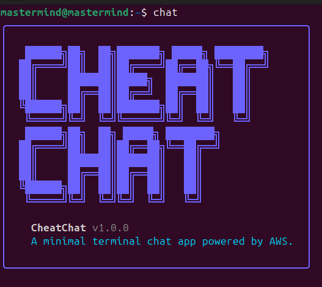
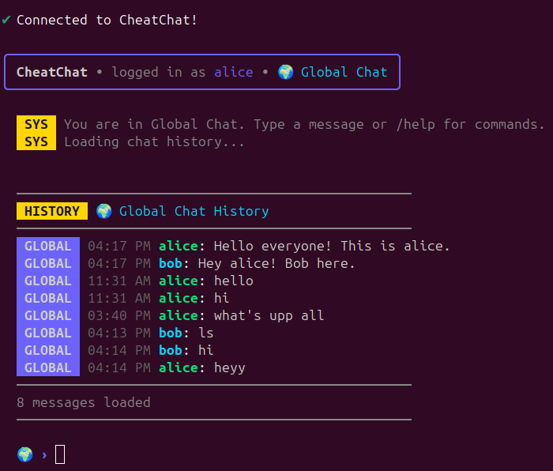
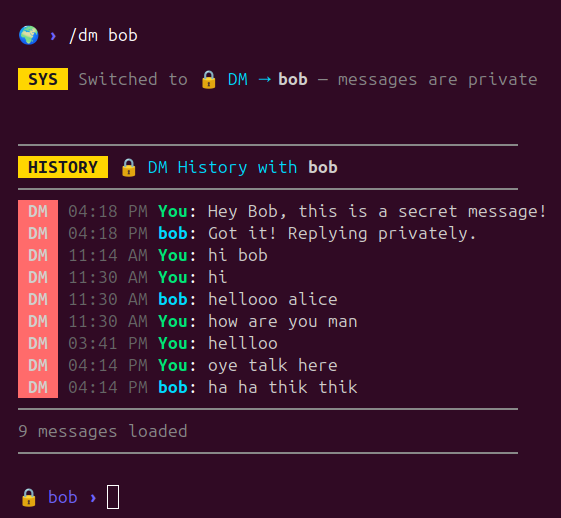
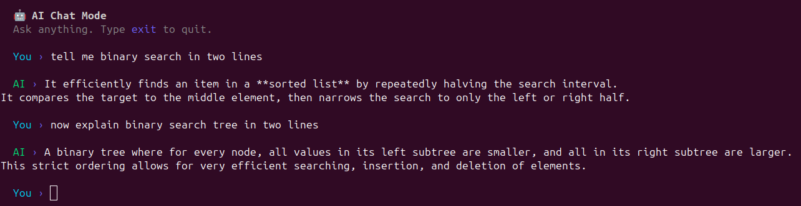
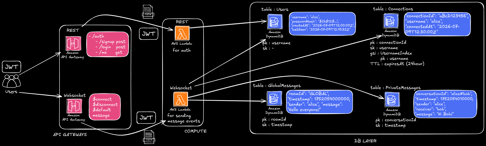

<div align="center">

# CheatChat

[](https://www.npmjs.com/package/cheatchat)
[]()

**A minimal, blazing-fast terminal chat app powered by AWS Serverless & Gemini AI.**



</div>

---

## Why CheatChat?

- **Lightweight:** Runs entirely in your terminal with zero visual bloat.
- **Fast:** Powered by AWS WebSockets for real-time, low-latency communication.
- **Terminal-First:** Designed for developers who live in the command line.
- **Serverless Backend:** Highly scalable, pay-per-use architecture leveraging AWS Lambda and DynamoDB.
- **Easy Installation:** Get started in seconds with a single curl command or npm.
- **AI Integration:** Built-in Google Gemini AI for terminal-based chatting and autonomous code file solving.

---

## Screenshots

> real-time terminal global chatting



> Private messaging



> Brainstorming with Gemini AI in the terminal



---

## Installation

There are two ways to install the CheatChat CLI on your machine. 

### Method 1: Install using `install.sh` (Recommended)

The absolute quickest way to get started. This script automatically configures your npm global directory (to prevent permission errors) and installs the package.

```bash
curl -fsSL https://raw.githubusercontent.com/ramoliyaYug/cheatChat/main/install.sh | bash
```

### Method 2: Install from npm

**Global Installation (Available anywhere in your terminal):**
```bash
npm install -g cheatchat
```

**Local Installation (Available only in the current project directory):**
```bash
npm install cheatchat
```

---
## Features

- User Authentication
- JWT Session Management
- Global Chat
- Private Messaging
- Chat History Retention
- Online Users Tracking
- Complete User Directory
- Interactive AI Chat
- AI Autonomous File Solver
- Serverless Cloud Backend

---

## Getting Started

Once installed, follow these steps to jump into the chat:

1. **Create an account:**
   ```bash
   chat signup
   ```
2. **Log in:**
   ```bash
   chat login
   ```
3. **Connect to the live chat server:**
   ```bash
   chat connect
   ```

Once connected, you will immediately enter the **Global chat** room, From there, you can easily switch to **Private messaging**, or exit to use our **AI tools**.

---

## CLI Commands

Outside of the active chat interface, the following commands are available in your terminal:

| Command | Description |
|---|---|
| `chat signup` | Create a new CheatChat account interactively. |
| `chat login` | Authenticate and securely store your session locally. |
| `chat logout` | Destroy your local session and clear credentials. |
| `chat whoami` | Display your current authenticated user profile. |
| `chat connect` | Connect to the WebSocket server and enter interactive chat mode. |
| `chat ai` | Start an interactive AI conversation directly in your terminal. |
| `chat solve <file>` | Automatically send a source file to Gemini AI to fix bugs or optimize code, then overwrite it. |
| `chat help` | Display the CLI help menu and command reference. |

---

## Chat Mode Commands

Once you run `chat connect` and enter the interactive terminal UI, you can use these slash commands:

| Command | Description |
|---|---|
| `/global` | Switch your current view and sending target to the Global chat room. |
| `/dm <username>` | Switch to a direct, private conversation with a specific user. |
| `/history` | Manually reload the message history for your current active chat. |
| `/users` | Display a complete list of every registered CheatChat user. |
| `/online` | Display a list of users currently connected to the WebSocket server. |
| `/help` | Display the in-chat help menu. |
| `/exit` | Safely sever the WebSocket connection and return to your standard terminal. |

---

## AI Features

CheatChat integrates with Google's **Gemini AI** to boost developer productivity without leaving the terminal.

### Interactive AI Chat
```bash
chat ai
```
Entering this command opens a dedicated, interactive AI chat prompt. You can ask questions, get code explanations, or brainstorm ideas. Type `exit` to leave the AI chat.

### AI File Solver
```bash
chat solve app.js
```
This powerful command reads the specified local file, sends the entire content to Gemini AI with instructions to fix bugs and optimize code, and safely **overwrites the original file** with the AI's improved output.

---

## Technologies

CheatChat is built using modern serverless cloud infrastructure and a robust Node.js CLI.

**Backend**
* AWS Lambda
* API Gateway (REST)
* API Gateway (WebSocket)
* DynamoDB
* Node.js / JavaScript
* JWT (JSON Web Tokens)
* bcrypt
* Gemini AI (Google)

**CLI Client**
* Node.js
* Commander
* Axios
* WebSocket (`ws`)
* Chalk
* Ora
* Inquirer

---

## Architecture

CheatChat leverages a completely serverless AWS architecture, ensuring it scales instantly and costs nothing when idle.


---

## Documentation

If you are interested in understanding its internal mechanics, check out these files:

- **`README.md`**: You are here! High-level overview and usage instructions.
- **`backend/src/apiDocumentation.md`**: Complete API specifications for both REST and WebSocket endpoints, including Postman testing guides.
- **`architecture/overview.excalidraw.png`**: A visual overview of the architecture.

---
<div align="center">
  <b>Built with ❤️ for the terminal.</b>
</div>
